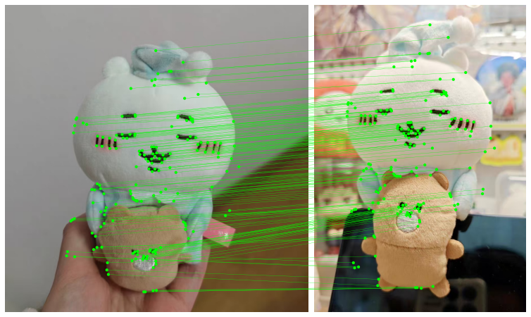
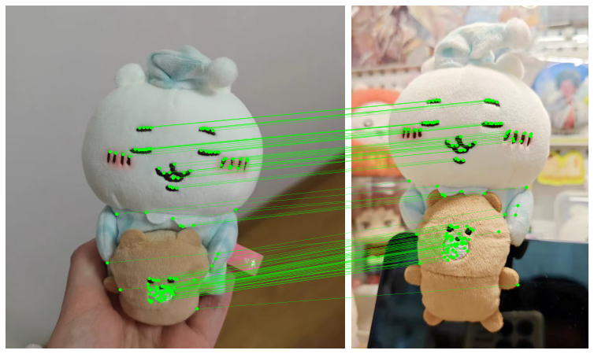

# OpenCV SLAM Feature Validation: ALIKED vs. SuperPoint


## Introduction
This repository contains the **preliminary validation code** for my Google Summer of Code (GSoC) 2026 proposal: *"Advanced OpenCV SLAM: Loop Closure, Global Optimization, and Robustness Improvements"*.

The goal of this experiment is to verify the feasibility of replacing traditional feature extractors (like ORB/SIFT) or older deep learning models (SuperPoint) with the State-of-the-Art **ALIKED** model within the OpenCV SLAM pipeline.

## Experiment & Observation
I implemented a comparative study between **SuperPoint** and **ALIKED** using the [LightGlue](https://github.com/cvg/LightGlue) matching framework. The system estimates the camera pose (Rotation `R` and Translation `t`) using OpenCV's `findEssentialMat` and `recoverPose`.

### Key Findings
My experiments reveal that **ALIKED** provides superior geometric consistency compared to SuperPoint, particularly in texture-less regions and object boundaries.

#### 1. Visual Comparison
As shown below, SuperPoint tends to generate outlier matches between the foreground object (the doll's hand) and the background. In contrast, ALIKED produces cleaner, highly reliable matches.

| **SuperPoint + LightGlue** | **ALIKED + LightGlue (Proposed)** |
|:--------------------------:|:---------------------------------:|
|  |  |
| *More outliers on boundaries* | *Higher precision & consistency* |


#### 2. Pose Estimation Output
The system successfully recovers the camera motion using the ALIKED features, validating the frontend pipeline for the proposed SLAM system.

```text
Visual Odometry Result(Example):
Rotation Matrix (R):
[[ 0.99...  -0.01...  ...]]
Translation Vector (t):
[[ 0.76... ]
 [ 0.64... ]
 [-0.00... ]]
```

## Quick Start
# 1. Create a clean environment
```
conda create -n gsoc_cv python=3.10
conda activate gsoc_cv
```

# 2. Install dependencies (LightGlue & ALIKED)
```
pip install git+[https://github.com/cvg/LightGlue.git](https://github.com/cvg/LightGlue.git)
pip install opencv-python matplotlib torch
```

# 3. Running the Demo
```
python Pre-GSoCWork.py
```
